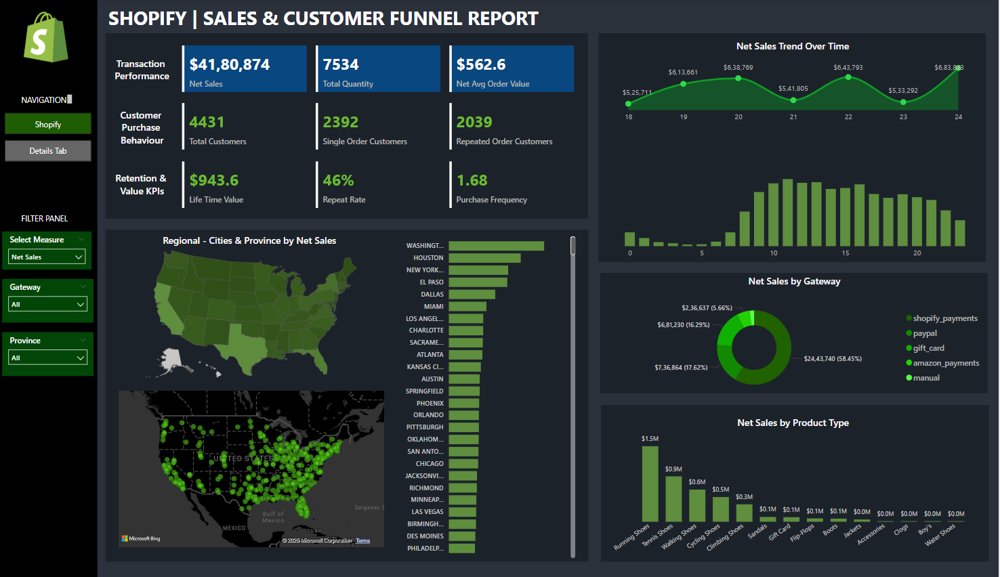

# 🛍️ Shopify Sales Analysis Dashboard – Power BI Project

## 📊 Project Overview

This Power BI project analyzes sales data from a Shopify e-commerce store to gain meaningful insights into revenue, customer behavior, product performance, and regional sales trends. The dashboard provides an interactive view to help stakeholders make data-driven decisions.

---

## 📁 Dataset

- Simulated Shopify sales data including:
  - Orders
  - Customers
  - Products
  - Sales transactions
- Data includes fields like order ID, customer ID, order date, product details, quantity, net sales, payment gateway and region.

---

## 🎯 Objectives

- Analyze sales performance by product, region, and Lifr time value (LTV).
- Segment customers into new vs. returning.
- Identify top-selling products and categories.
- Explore hourly and daily trends in sales and orders.

---

## 🧰 Tools & Technologies

- **Power BI**: Dashboard creation and data visualization  
- **Power Query**: Data cleaning and transformation  
- **DAX (Data Analysis Expressions)**: KPI calculations and measures  
- **Excel**: Initial data handling (optional)  

---

## 📈 Key Features

- Interactive dashboard with slicers to filter by:
  - Net Sales
  - Total quantity
  - Province
  - Payment gateway
- Visuals include:
  - Bar charts, Map charts, donut charts, KPIs, and tables
- Custom DAX measures such as:
  - Net Sales
  - Life time value
  - Repeat Purchase Rate

---

## 📷 Dashboard Preview
 

---

## 🚀 How to Use

1. Clone or download this repository.
2. Open the Power BI file (`shopify_sales_analysis.pbix`).
3. Connect to your dataset or explore using the sample data provided.
4. Use slicers to interact with the visuals.

---

## 📌 Insights Gained

- Identified peak days and hours product lines.
- Observed customer trends such as high conversion from repeat buyers.
- Region-based insights showed where to focus marketing efforts.

---

## 📎 Project Status

✅ Completed  
🔜 Adding more advanced DAX metrics and forecasting visuals in future updates.

---

## 📬 Contact

**Muthusundar**  
📧 muthusundard1148@gmail.com  
🔗 [LinkedIn](https://www.linkedin.com/in/muthu-sundar-320103154)  
🔗 [GitHub](https://github.com/muthusundar48/muthusundar48)

---

